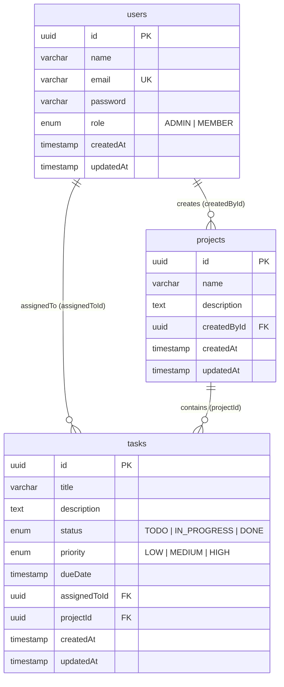

# Database Schema & Data Dictionary

Comprehensive documentation for PostgreSQL database tables, models, relationships, and indexing strategies used in **TaskPulse**.

---

## Entity Relationship (ER) Diagram

---

## Table Specifications

### 1. `users` Table
Stores user accounts for authentication and workspace authorization.

| Column | Type | Constraints | Description |
| :--- | :--- | :--- | :--- |
| `id` | `UUID` | `@id`, `default(uuid())` | Primary key identifier |
| `name` | `VARCHAR` | `NOT NULL` | Full user display name |
| `email` | `VARCHAR` | `UNIQUE`, `NOT NULL` | User email address used for sign-in |
| `password` | `VARCHAR` | `NOT NULL` | bcrypt hashed password string |
| `role` | `ENUM(Role)`| `DEFAULT 'MEMBER'` | Authorization role (`ADMIN` or `MEMBER`) |
| `createdAt`| `TIMESTAMP`| `DEFAULT now()` | Record creation timestamp |
| `updatedAt`| `TIMESTAMP`| `@updatedAt` | Record update timestamp |

#### Indexes
- `users_email_key`: Unique index on `email` column for $O(1)$ authentication lookup.

---

### 2. `projects` Table
Stores project workspaces created by Admin users.

| Column | Type | Constraints | Description |
| :--- | :--- | :--- | :--- |
| `id` | `UUID` | `@id`, `default(uuid())` | Primary key identifier |
| `name` | `VARCHAR` | `NOT NULL` | Project title |
| `description`| `TEXT` | `NULLABLE` | Overview and scope details |
| `createdById`| `UUID` | `FK -> users(id)` | User who created the project |
| `createdAt`| `TIMESTAMP`| `DEFAULT now()` | Creation timestamp |
| `updatedAt`| `TIMESTAMP`| `@updatedAt` | Update timestamp |

#### Relationships & Constraints
- `createdBy`: Foreign key referencing `users.id` with `ON DELETE CASCADE`.

---

### 3. `tasks` Table
Stores granular deliverables linked to projects and assigned to team members.

| Column | Type | Constraints | Description |
| :--- | :--- | :--- | :--- |
| `id` | `UUID` | `@id`, `default(uuid())` | Primary key identifier |
| `title` | `VARCHAR` | `NOT NULL` | Deliverable title |
| `description`| `TEXT` | `NULLABLE` | Technical notes and criteria |
| `status` | `ENUM` | `DEFAULT 'TODO'` | Status: `TODO`, `IN_PROGRESS`, `DONE` |
| `priority` | `ENUM` | `DEFAULT 'MEDIUM'`| Priority: `LOW`, `MEDIUM`, `HIGH` |
| `dueDate` | `TIMESTAMP`| `NULLABLE` | Target completion date |
| `assignedToId`| `UUID` | `FK -> users(id)` | Member assigned to task (`NULLABLE`) |
| `projectId` | `UUID` | `FK -> projects(id)`| Associated project workspace |
| `createdAt`| `TIMESTAMP`| `DEFAULT now()` | Creation timestamp |
| `updatedAt`| `TIMESTAMP`| `@updatedAt` | Update timestamp |

#### Relationships & Constraints
- `assignedTo`: Foreign key referencing `users.id` with `ON DELETE SET NULL`.
- `project`: Foreign key referencing `projects.id` with `ON DELETE CASCADE`.

---

## Database Seeding Strategy (`prisma/seed.ts`)

When executing `pnpm db:seed`:
1. **Existing records cleared**: `tasks`, `projects`, and `users` tables emptied to prevent ID collisions.
2. **Users Seeded**:
   - `admin@example.com` (`Role.ADMIN`)
   - `sarah@example.com` (`Role.MEMBER`)
   - `john@example.com` (`Role.MEMBER`)
3. **Projects Seeded**:
   - `Platform Redesign v2`
   - `Mobile App API Integration`
   - `Security Audit & Compliance`
4. **Tasks Seeded**: 10 tasks distributed across statuses (`TODO`, `IN_PROGRESS`, `DONE`) and priorities (`LOW`, `MEDIUM`, `HIGH`), including overdue tasks for dashboard telemetry validation.
