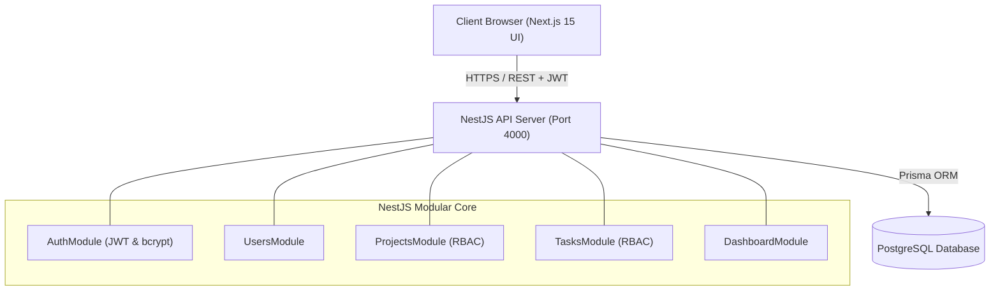
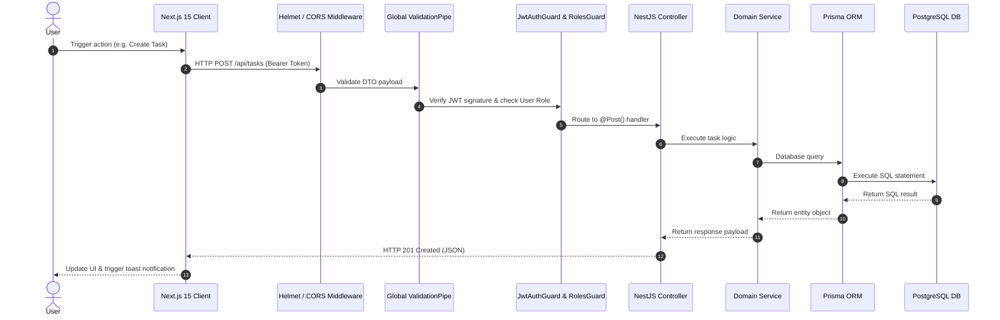
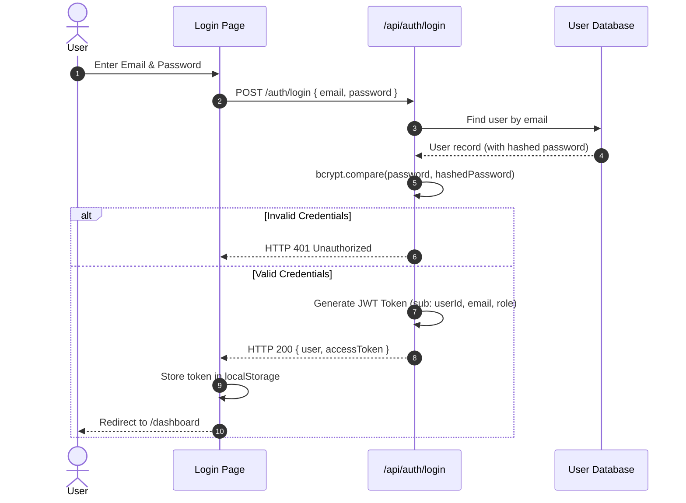
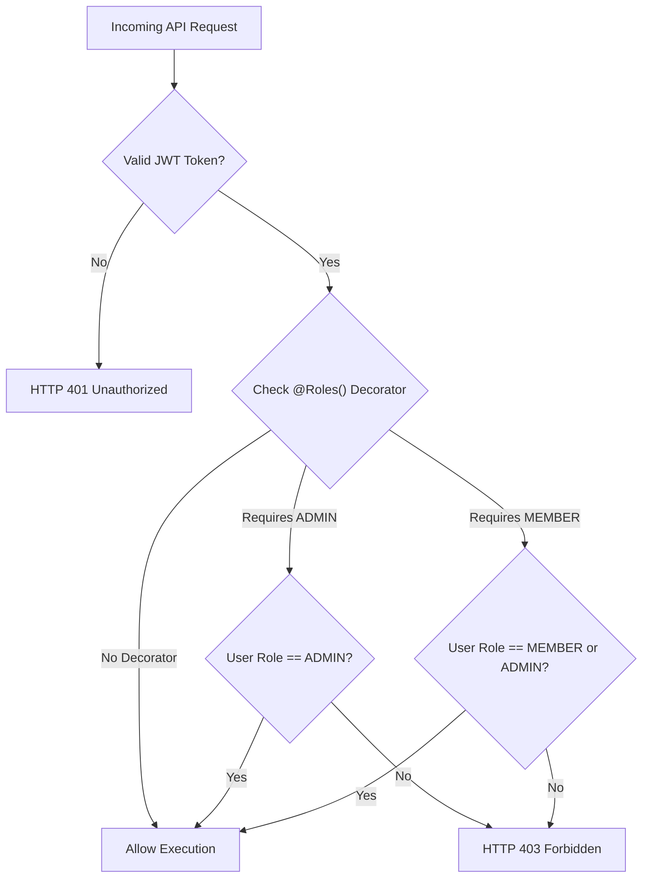
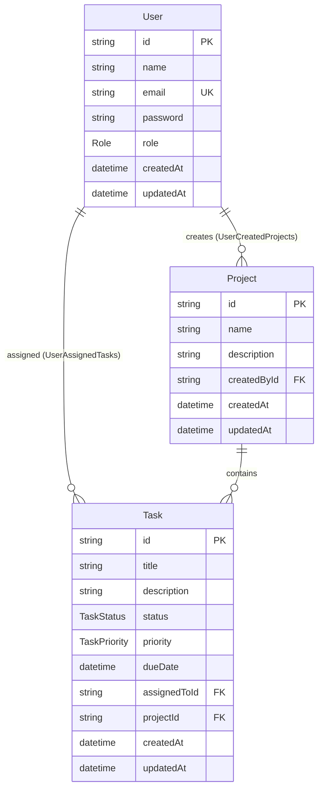
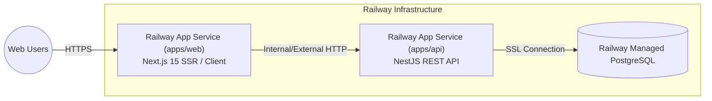

# System Design & Architecture Specification

Detailed architectural specifications, execution flow diagrams, authentication mechanisms, and deployment topology for **TaskPulse (Team Task Manager)**.

---

## 1. High-Level Architecture

The system is designed as a modular monorepo using **`pnpm` workspaces**. The backend API is built on NestJS following Clean Architecture principles (Controllers -> Services -> Prisma Repository -> PostgreSQL), while the frontend is a Next.js 15 App Router application providing dynamic server and client components.

---

## 2. Request Flow

When an HTTP request enters the NestJS application, it flows sequentially through security middleware, global pipes, authorization guards, and logging interceptors:

---

## 3. Authentication Flow

Authentication is built using JWT (JSON Web Tokens) signed with an HMAC SHA-256 secret.

---

## 4. Role-Based Access Control (RBAC) Flow

The system enforces strict permission boundaries between `ADMIN` and `MEMBER` accounts:

### Access Matrix

| Action | Admin Privilege | Member Privilege |
| :--- | :---: | :---: |
| **Create Project** | ✅ | ❌ |
| **Update Project** | ✅ | ❌ |
| **Delete Project** | ✅ | ❌ |
| **Create & Assign Task** | ✅ | ❌ |
| **Delete Task** | ✅ | ❌ |
| **View Dashboard** | ✅ (Global) | ✅ (Assigned Scope) |
| **View Projects** | ✅ (All) | ✅ (Assigned Only) |
| **Update Task Status** | ✅ | ✅ (Assigned Tasks) |

---

## 5. Database Entity Relationships

---

## 6. Deployment Architecture

The application is prepared for deployment on **Railway** (or Nixpacks/Docker environments):

